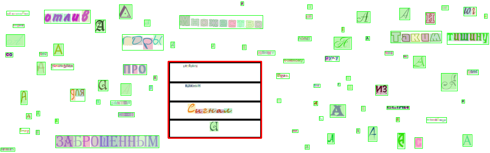

# CharGrid Generator: synthetic chargrid data generator
Synthetic chargrid data generation utility

### Example of generated data

You can find generation examples in the "gen_data" folder.

### Config
Before you start generating, configure your generation in "config.yaml"

**You can**:
 - set the number of images to generate
 - set the path to save the generated data
 - define alphabet - string of valid characters
 - define images size
 - set rows angle range
 - set number of words in page range
 - using stable-diffusion for generating random background
 - choice backgrounds folder to generate
 - adding backgrounds augmentation (for example, an augmentation that adds a barcode has been added)
 - define fonts
 - set fonts size range
 - set fonts color range
 - choice text generator (words from random alphabet chars or words from source text)
 - set numbers of table cells range

### Run
For start generation run **"run.py"** with

**args**:

**--config**: str, default="config.yaml"    config.yaml file path

**--debug**: bool, default="True"           save debug images

In result, you will get a folder with 5 subfolders:
 - **char_masks**    contains .npy chargrid masks
 - **field_masks**   contains .npy row masks
 - **images**        contains .png text images
 - **row _coords**   contains .json rows coords
 
 if debug
 - **plots**         contains .png debug images